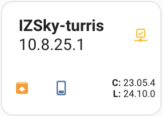

# OpenWRT Updater
[](https://github.com/hacs/integration)

This Home Assistant integration allows you to monitor and update OpenWRT-based routers over SSH. It supports checking OS version, verifying available updates, and triggering firmware updates remotely. It also lets you set device-specific configurations through selectable options.

## Features

### Device Discovery
Register your OpenWRT devices via config flow.
### Update
- See available firmware updates and trigger upgrades.
- Change configuration type (device model) dynamically.
- Select simple update with standart snapshot for your device or with custom image builder
- Choose between force update or soft one that requires manual sysupgrade launch.
### Monitoring
Monitor device status (online/offline).

## Installation

1. Install “OpenWRT Updater” from default HACS repository or copy `custom_components/openwrt_updater` to your `config/custom_components` directory.
2. Restart Home Assistant.
3. Go to Settings → Devices & Services → Integrations → Add Integration → Search for “OpenWRT Updater”.

## Configuration

Set **global options** (stored in a special config entry):
- `ssh_key_path` — path to the private SSH key (default: `/config/ssh_keys/id_ed25519`).
- `toh_url` — URL to Table of Hardware JSON (default: `https://openwrt.org/toh.json`).
- `config_types_file` — YAML file with device type mappings (default: `config_types.yaml`).
- `toh_timeout_hours` — refresh interval for TOH cache.
- `device_timeout_minutes` — timeout for device polling.
After global options are configured, create a **Place** (config entry for grouping devices).  
Then add devices by specifying:
- Device IP
- Configuration type (list of available types is loaded from the YAML file defined in `config_types_file`).

You can define config types in `config_types_file` like this:
```yaml
zip-3200:
  openwrt-devid: linksys:linksys_wrt3200acm
  name: WRT3200-ACM
```

## Dashboards

I wanted a glance view of my whole landscape, so I'm trying to use button-card for it. You can find template for it in `extra_files/button-card-template.yaml`. It's in early pre-alfa, but I still want to share it. Maybe someone will modify it for a better view.

